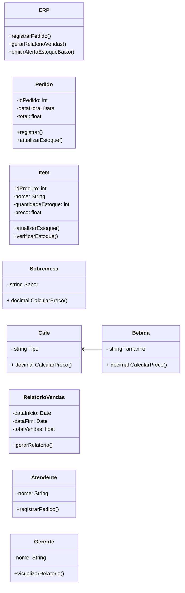

```mermaid 
classDiagram
    direction LR

    class ERP {
        +registrarPedido()
        +gerarRelatorioVendas()
        +emitirAlertaEstoqueBaixo()
    }

    class Pedido {
        -idPedido: int
        -dataHora: Date
        -total: float
        +registrar()
        +atualizarEstoque()
    }

    class Item {
        -idProduto: int
        -nome: String
        -quantidadeEstoque: int
        -preco: float
        +atualizarEstoque()
        +verificarEstoque()
    }

    class Sobremesa{
        - string Sabor
        + decimal CalcularPreco()
    }

    class Cafe{
        - string Tipo
        + decimal CalcularPreco()
    }

    class Bebida{
        - string Tamanho
        + decimal CalcularPreco()
    }

    class RelatorioVendas {
        -dataInicio: Date
        -dataFim: Date
        -totalVendas: float
        +gerarRelatorio()
    }

    class Atendente {
        -nome: String
        +registrarPedido()
    }

    class Gerente {
        -nome: String
        +visualizarRelatorio()
    }

    Cafe <-- Bebida
    
```
