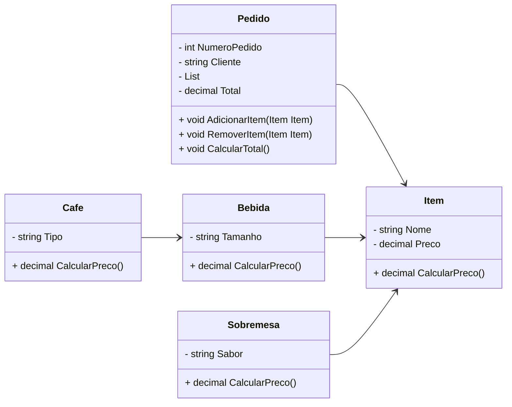

```mermaid

classDiagram
    direction LR

    class Pedido{
        - int NumeroPedido
        - string Cliente
        - List <Item>
        - decimal Total
        + void AdicionarItem(Item Item)
        + void RemoverItem(Item Item)
        + void CalcularTotal()
    }

    class Item{
        - string Nome
        - decimal Preco
        + decimal CalcularPreco()
    }

    class Bebida{
        - string Tamanho
        + decimal CalcularPreco()
    }

    class Cafe{
        - string Tipo
        + decimal CalcularPreco()
    }

    class Sobremesa{
        - string Sabor
        + decimal CalcularPreco()
    }

    Pedido --> Item

    Bebida --> Item

    Sobremesa --> Item

    Cafe --> Bebida

```